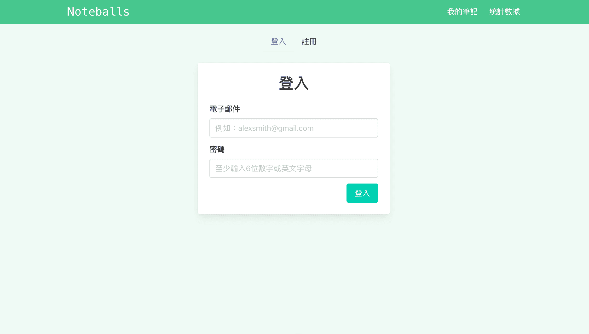
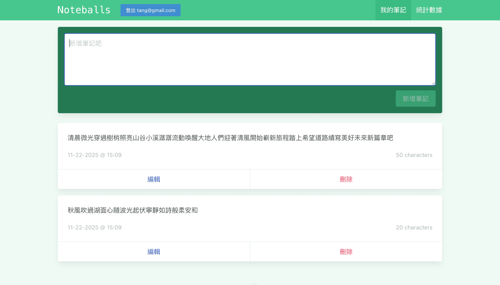
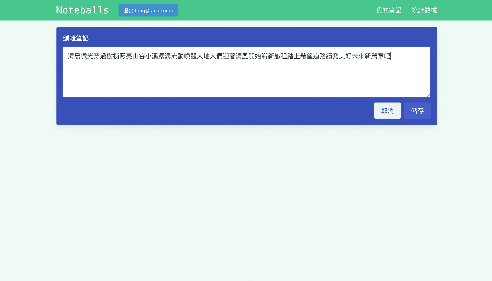
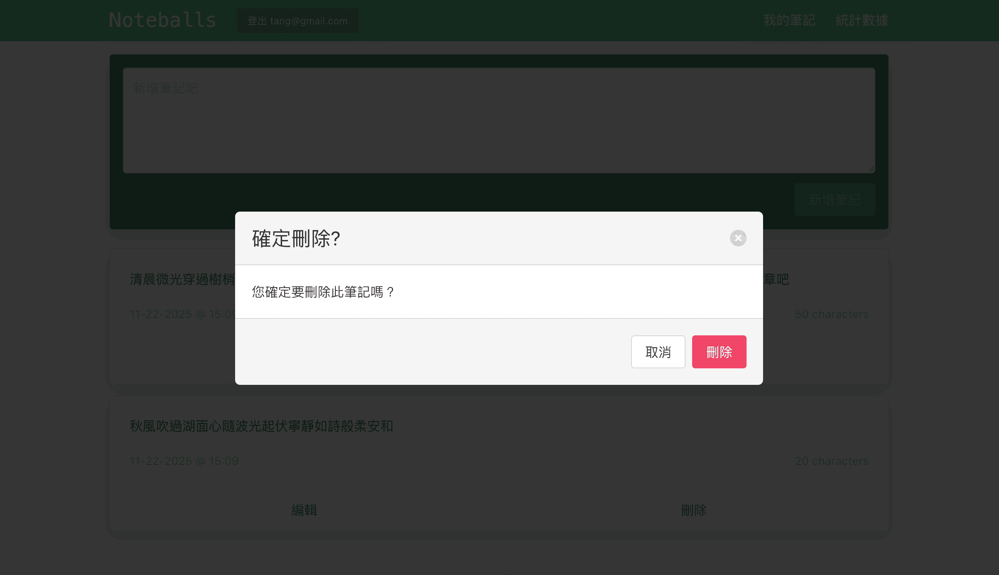
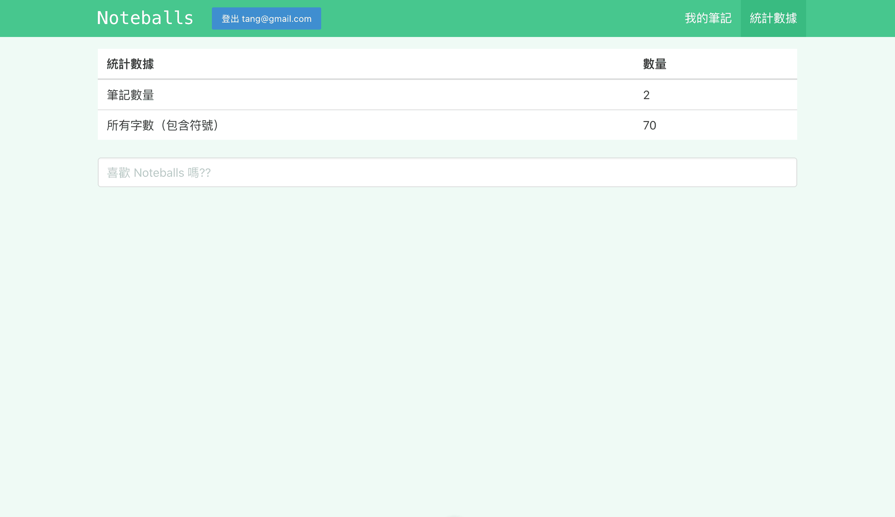

# 📝 Vue 筆記網站

使用 **Vue**, **Vue Router**, **Pinia**, **Firebase** 打造的筆記網站，提供使用者註冊/登入、筆記檢視、編輯、刪除與統計功能，並將資料同步至 Firebase。

---

## 🔑 功能概覽

- 使用者驗證：登入 / 註冊頁面連接 Firebase Authentication 管理使用者帳號。
- 筆記管理：根據使用者資料從 Firebase Database 讀取筆記，支援新增、編輯與刪除，資料同步至後端。
- 編輯同步：在前端修改筆記後即時更新 Firebase 後端資料。
- 刪除同步：刪除筆記時同時從後端移除資料。
- 統計資訊：顯示所有筆記數量與字數等統計數據。

---

## 🖼 圖片

| 登入 / 註冊                    | 筆記列表 / 檢視                     |
| ------------------------------ | ----------------------------------- |
|  |  |

| 編輯筆記                               | 刪除筆記                                   |
| -------------------------------------- | ------------------------------------------ |
|  |  |

| 統計數據                       |
| ------------------------------ |
|  |

---
